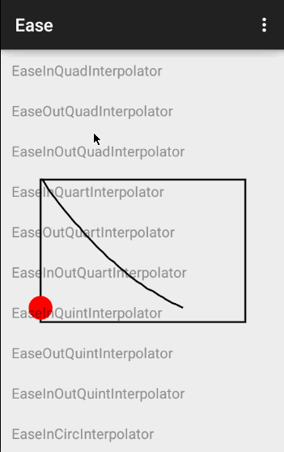

EaseAnimationInterpolator
====

Easing Animation Interpolator for Android. Just more Interpolators can be used.

Inspired by [AnimationEasingFunctions](https://github.com/daimajia/AnimationEasingFunctions) and [Easing Functions](http://easings.net/). Convert the Easing Functions into Android Interpolators so that you can use them more easily.

## Demo

